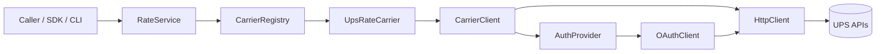

# Cybership Carrier Integration (UPS Rating)

Production-oriented TypeScript module that wraps the UPS Rating API behind a clean domain model. It’s structured so you can add more carriers (FedEx / USPS / DHL) and more operations later without rewriting existing code.

This repo includes:
- **OAuth2 client-credentials** with caching, refresh buffer, concurrency dedupe, and **401 refresh+retry**
- **Rate shopping** with normalized quotes (callers never touch UPS payload shapes)
- **Clean layering** (domain / application / integrations / infrastructure)
- **Strong types + runtime validation** (Zod) for inputs and external responses
- **Structured errors** with `code`, `carrier`, and `retryable`
- **Integration tests** using a stubbed HTTP layer (no real network calls)
- **Polish**: carrier plugin registration, retry/backoff, circuit breaker, optional in-memory cache, redacted logs, OTel tracing hooks, CLI, Dockerfile, Makefile

## Quick start

```bash
npm install
cp .env.example .env
npm run build
npm test
```

## CLI demo

```bash
npm run cli -- --file request.json
# or
npm run cli -- --request '{"origin":...,"destination":...,"packages":[...]}'
```

The CLI prints a JSON payload with per-carrier results (success or structured error).

## SDK usage

```ts
import { createCybershipRatesClient } from './dist';

const client = createCybershipRatesClient({
  enableRateCache: true,
  usePino: true,
  useOpenTelemetry: true,
  serviceName: 'cybership-carrier-integration'
});

const results = await client.service.getRatesDetailed({
  origin: { street: ['1 Main'], city: 'Atlanta', state: 'GA', postalCode: '30339', country: 'US' },
  destination: { street: ['2 Main'], city: 'Austin', state: 'TX', postalCode: '73301', country: 'US' },
  packages: [{ weight: 1, length: 1, width: 1, height: 1 }]
});
```

## Architecture

The “shape” is ports/adapters style: the application layer defines the interfaces, integrations implement them, and infrastructure provides concrete adapters.



### Folder layout

```
src/
├── domain/              domain types + validation + error hierarchy
├── application/         RateService + ports + CarrierRegistry
├── integrations/        carrier plugins (UPS is implemented)
├── infrastructure/      http/auth/logging/tracing/retry/circuit-breaker/cache
├── sdk/                 typed client factory for consumers
├── cli/                 demo CLI
└── __tests__/            unit + integration tests (stubbed HttpClient)
```

## Extensibility (carrier plugins)

UPS is registered via a plugin-style entrypoint:

- `registerUpsRateCarrier(registry, options)`

Adding FedEx later should look like adding `src/integrations/fedex/` with a similar `registerFedExRateCarrier(...)`. `RateService` and the domain model don’t need to change.

## Observability & resilience

- **Logging**: `InstrumentedHttpClient` logs request/response metadata with header redaction (`Authorization`).
- **Tracing hooks**: `OpenTelemetryTracer` is a thin adapter over `@opentelemetry/api`.
- **Retry strategy**: exponential backoff (pluggable) via `RetryingCarrierClient` (enabled by default in the UPS plugin).
- **Circuit breaker**: opens after consecutive failures (enabled by default in the UPS plugin).
- **Rate cache**: optional in-memory cache wired into `RateService`.

## Testing

All tests use a stubbed `HttpClient` so nothing hits the network.

```bash
npm test
npm run test:coverage
```

## Config

| Variable | Required | Default |
|----------|----------|---------|
| `UPS_CLIENT_ID` | Yes | - |
| `UPS_CLIENT_SECRET` | Yes | - |
| `UPS_BASE_URL` | No | `https://onlinetools.ups.com` |
| `UPS_AUTH_URL` | No | UPS OAuth endpoint |
| `UPS_ACCOUNT_NUMBER` | No | - |
| `UPS_TIMEOUT_MS` | No | `30000` |
| `LOG_LEVEL` | No | `info` |

## Docker

```bash
docker build -t cybership-carrier-integration .
docker run --rm cybership-carrier-integration
```

## License

MIT
